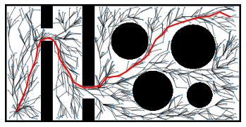

# FMT

Python implementation of Fast Marching Tree (https://arxiv.org/abs/1306.3532)

## Requirements
- Python (3.7.7)
- numpy (1.19.2)
- scipy (1.5.3)
- networkx (2.5)
- pqdict (1.1.1)
- See `requirements.txt` for full requirements

## How it works
See [`example.ipynb`](https://github.com/yonetaniryo/fmt/blob/main/example.ipynb).

## Implementation note
- I put Line 4 (`N_z = Near(V\{z}, z, r_n)`) into the while loop from Line 6 in Algorithm 2 as I believe it necessary to get the planning worked.
- In addition to the original algorithm of FMT that refered to the only cost-to-arrive from `x_init` (in Line 18 of Algorithm 2), our implementation has the option to additionally use the Euclidiean distance to the goal for efficient search like A*.
- Implementation of `check_collision` is based on [PythonRobotics](https://github.com/AtsushiSakai/PythonRobotics).

## Reference

Janson, Lucas, et al. "Fast marching tree: A fast marching sampling-based method for optimal motion planning in many dimensions." The International journal of robotics research 34.7 (2015): 883-921.
